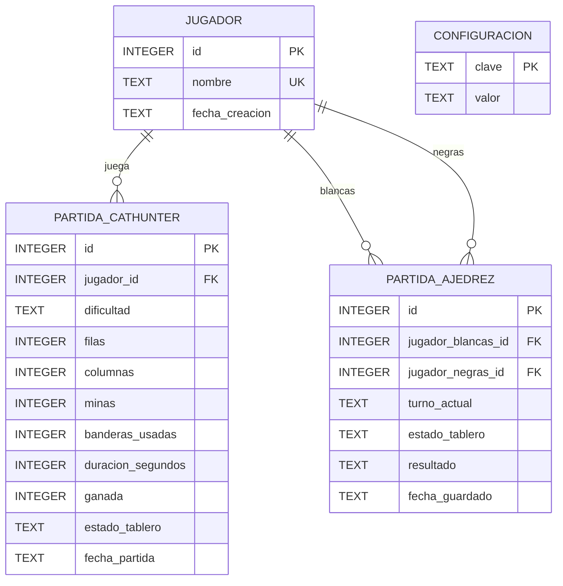

# Diagrama Relacional

Este archivo recoge el diagrama relacional actual de la base de datos del proyecto.
Se ha representado en formato `Mermaid` para poder visualizarlo en GitHub, VS Code o Mermaid Live.

## Explicacion breve

- `jugador` almacena los perfiles de jugadores.
- `configuracion` guarda pares simples `clave -> valor` para ajustes globales.
- `partida_cathunter` guarda partidas de Buscagatos y referencia a un jugador.
- `partida_ajedrez` guarda partidas de Ajedrez y referencia a los jugadores de blancas y negras.

## Notas

- `configuracion` no tiene relaciones con otras tablas porque actua como tabla de preferencias globales.
- `partida_ajedrez` tiene dos claves foraneas hacia `jugador`:
  - una para el jugador de blancas
  - otra para el jugador de negras
- El campo `estado_tablero` se guarda como `TEXT` para permitir una serializacion sencilla del estado del juego.
