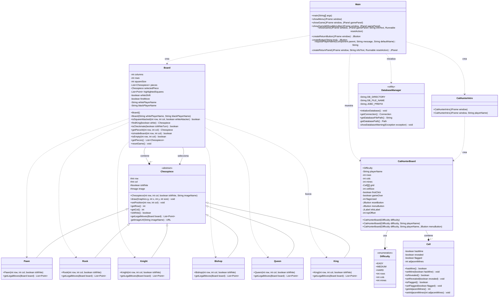

# Diagrama UML Actual

Este archivo recoge el diagrama de clases UML del estado actual del proyecto.
Se ha representado en formato `Mermaid` para que pueda visualizarse en GitHub.

```mermaid
classDiagram
    class Main {
        +main(String[] args)
        +showMenu(JFrame window)
        +showGame(JFrame window, JPanel gamePanel)
        +showGameWithoutMenuBar(JFrame window, JPanel gamePanel)
        +showGame(JFrame window, JPanel gamePanel, String infoText, Runnable resetAction)
        +createReturnButton(JFrame window) JButton
        -createButton(String text) JButton
        -requestPlayerName(Component parent, String message, String defaultName) String
        -createReturnPanel(JFrame window, String infoText, Runnable resetAction) JPanel
    }

    class Board {
        -int columns
        -int rows
        -int squareSize
        -List~Chesspiece~ pieces
        -Chesspiece selectedPiece
        -List~Point~ highlightedSquares
        -boolean whiteShift
        -boolean firstMove
        -String whitePlayerName
        -String blackPlayerName
        +Board()
        +Board(String whitePlayerName, String blackPlayerName)
        +isSquareAttacked(int row, int col, boolean whiteAttacker) boolean
        +findKing(boolean white) Chesspiece
        +isCheckmate(boolean isWhiteTurn) boolean
        +getPieceAt(int row, int col) Chesspiece
        +isInsideBoard(int row, int col) boolean
        +isEmpty(int row, int col) boolean
        +getPieces() List~Chesspiece~
        +resetGame() void
    }

    class Chesspiece {
        <<abstract>>
        #int row
        #int col
        #boolean isWhite
        #Image image
        +Chesspiece(int row, int col, boolean isWhite, String imageName)
        +draw(Graphics g, int x, int y, int size) void
        +setPosition(int row, int col) void
        +getRow() int
        +getCol() int
        +isWhite() boolean
        +getLegalMoves(Board board) List~Point~
        -getImageUrl(String imageName) URL
    }

    class Pawn {
        +Pawn(int row, int col, boolean isWhite)
        +getLegalMoves(Board board) List~Point~
    }

    class Rook {
        +Rook(int row, int col, boolean isWhite)
        +getLegalMoves(Board board) List~Point~
    }

    class Knight {
        +Knight(int row, int col, boolean isWhite)
        +getLegalMoves(Board board) List~Point~
    }

    class Bishop {
        +Bishop(int row, int col, boolean isWhite)
        +getLegalMoves(Board board) List~Point~
    }

    class Queen {
        +Queen(int row, int col, boolean isWhite)
        +getLegalMoves(Board board) List~Point~
    }

    class King {
        +King(int row, int col, boolean isWhite)
        +getLegalMoves(Board board) List~Point~
    }

    class CatHunterIntro {
        +CatHunterIntro(JFrame window)
        +CatHunterIntro(JFrame window, String playerName)
    }

    class CatHunterBoard {
        +Difficulty
        -String playerName
        -int rows
        -int cols
        -int mines
        -Cell[][] grid
        -int cellSize
        -boolean firstClick
        -boolean gameOver
        -int flagsUsed
        -JButton resetButton
        -JButton menuButton
        -JLabel infoLabel
        -int topOffset
        +CatHunterBoard(Difficulty difficulty)
        +CatHunterBoard(Difficulty difficulty, String playerName)
        +CatHunterBoard(Difficulty difficulty, String playerName, JButton menuButton)
    }

    class Difficulty {
        <<enumeration>>
        +EASY
        +MEDIUM
        +HARD
        +int rows
        +int cols
        +int mines
    }

    class Cell {
        -boolean hasMine
        -boolean revealed
        -boolean flagged
        -int adjacentMines
        +hasMine() boolean
        +setMine(boolean hasMine) void
        +isRevealed() boolean
        +setRevealed(boolean revealed) void
        +isFlagged() boolean
        +setFlagged(boolean flagged) void
        +getAdjacentMines() int
        +setAdjacentMines(int adjacentMines) void
    }

    class DatabaseManager {
        <<utility>>
        -String DB_DIRECTORY
        -String DB_FILE_NAME
        -String JDBC_PREFIX
        +initializeDatabase() void
        +getConnection() Connection
        +getDatabaseFilePath() String
        -getDatabasePath() Path
        -showDatabaseWarning(Exception exception) void
    }

    Main ..> Board : crea
    Main ..> CatHunterIntro : crea
    Main ..> DatabaseManager : inicializa
    Main ..> CatHunterBoard : muestra

    Board --* "0..*" Chesspiece : contiene
    Board --> Chesspiece : selecciona
    Board ..> King : busca
    Board ..> Pawn
    Board ..> Rook
    Board ..> Knight
    Board ..> Bishop
    Board ..> Queen

    Chesspiece <|-- Pawn
    Chesspiece <|-- Rook
    Chesspiece <|-- Knight
    Chesspiece <|-- Bishop
    Chesspiece <|-- Queen
    Chesspiece <|-- King

    CatHunterIntro ..> CatHunterBoard : crea
    CatHunterBoard --* "1" Difficulty : usa
    CatHunterBoard --* "1..*" Cell : contiene
```